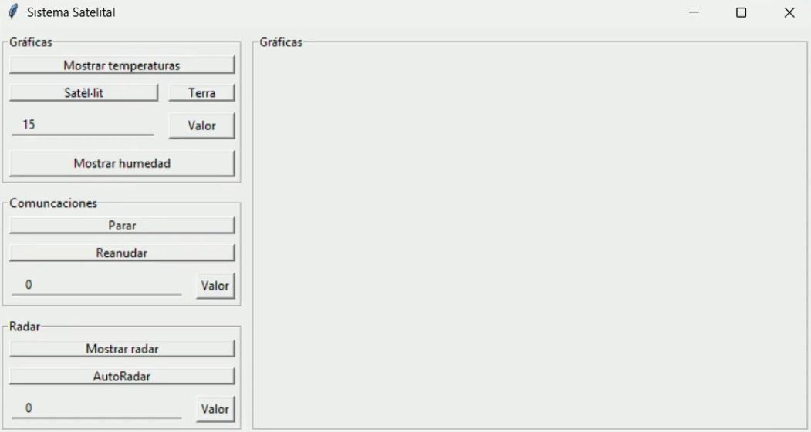
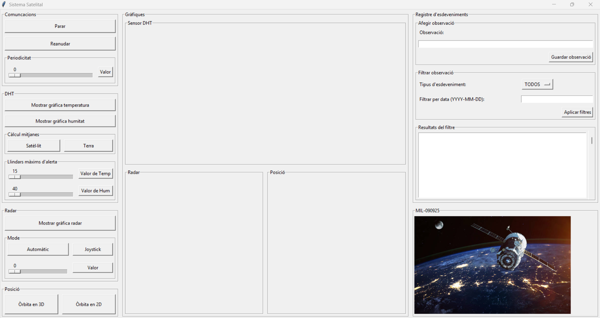
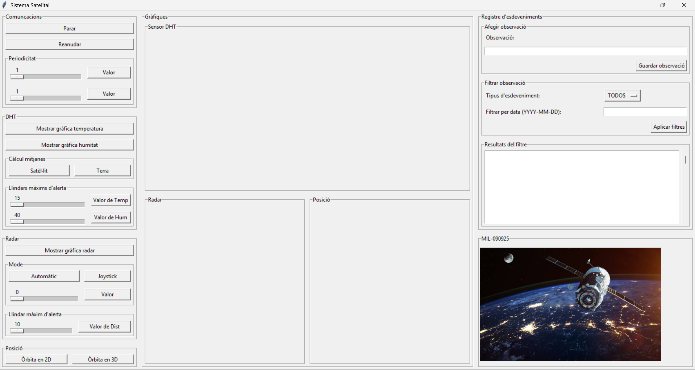
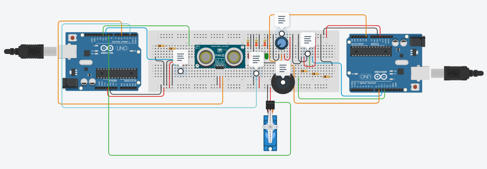

# Sistema Satel·lital

Projecte de l'assignatura de Ciències de la Computació. Implementació del prototip d'un sistema satel·lital compost pel satèl·lit i l'estació de terra.

## CARTA DE PRESENTACIÓ DEL PROJECTE:
L'agència de Ciències de la Computació de la universitat de la UPC, amb motiu de la creació d'un nou satèl·lit, va contactar amb un grup de tres enginyers perfectament qualificats per aquesta missió. Ens van fer una llista amb els requisits que ells mateixos volien, els quals nosaltres vam separar en 3 versions diferents. El principal objectiu de la seva missió era captar la humitat i la temperatura de regions diferents de l'espai. Així doncs, el dia 09/09/2025 tots tres: l'Íngrid Ubieto, en Miguel Ferrero i la Lucía Rodríguez ens vam posar en marxa. És cert que ens van donar molt menys temps del que ens hagués agradat, però tot i així, creiem haver superat el repte que ens van proposar els dos generals de l'operació: en Miguel Valero i en Juan Lopez. En finalitzar la versió tres, ens van proposar una tasca molt més perillosa i complicada; que el nostre sistema satel·litari contingui un element que els sorprengui. Després de mesos treballant en el projecte, finalment, avui dia 17/12/2025, els membres del grup 11 estem orgullosos de l'estat en què hem deixat la versió final.   
En aquest README podreu comprovar la nostra evolució a través de vídeos, el funcionament del nostre protocol d'aplicació per la transmissió de dades i les connexions del nostre sistema satel·litari.

### Vídeo de la [Versió 1](https://youtu.be/uBuVtdbzSjU)  
En la primera versió d'aquest projete es va aconseguir el següent:   
· L'emissió de dades entre els dos arduinos   
· La detecció d'errors en captar les dades del sensor DHT   
· Implementació d'un LED que s'encén cada vegada que l'arduino satèl·lit envia dades vàlides   
· La detecció de un fallo en la comunicació entre els arduinos, és a dir, si s'esta més de 5 segons sense haver-hi intercanvi de dades entre les dues plaques salta una alarma   
· Implementació d'un LED que s'encén cada vegada que l'arduino de l'estació de terra rep dades vàlides   
· Definició de la funció per processar les dades que arriben del satèl·lit   
· Definició de les ordres de iniciar, parar i reanudar les dades que rebem   
· Creació d'una interfície amb botons   
· Gràfica de les dades de temperatura (on es mostren les dades de temperatura que recull el DHT)   
· Implementació del THREAD   

### Vídeo de la [Versió 2](https://youtu.be/e1XV5jPOSLc)  
En la segona versió d'aquest projecte es va aconseguir el següent:   
· Botons i gràfiques incrustats dins d'una interfície gràfica (anomenada Sistema Satel·lital)   
· Gràfica de les dades d'humitat (on es mostren les dades d'humitat que recull el DHT)      
· Gràfica del radar (on es mostren les dades de distància que recull l'ultrasons)      
· Implementació mode del radar (moviment que escombra una zona des de 0 a 180 graus)   
· Alarma d'Error de la comunicació d'arduinos (sistema millorat)   
· Alarma d'Error de lectura de DHT   
· Alarma d'Error de lectura de l'Ultrasons   
· Alarma d'Error d'alta temperatura (quan la temperatura captada és superior al llindar establert)   
· Estructrues de tots els codis passats a funcions   
· Implementació d'un Protocol d'Aplicació (explicat més endavant)   

### Vídeo de la [Versió 3](https://youtu.be/HDT-QbDbMX0)  
En la tercera versió d'aquest projecte es va aconseguir el següent:   
· Slidder per canviar i modificar la periodicitat de les dades   
· Botons perquè l'usuari decideixi on vol calcular les mitjanes de temperatura i humitat   
· Mitjanes de temperatura (calculades amb python) mostrades en el gràfic de temperatura      
· Mode manual del radar (on l'usuari decideix manualment la direcció que ha de pendre el servo)   
· Entrada de text per afegir observacions de l'usuari   
· Capacitat per filtrar els esdeveniments que es troben dins d'un fitxer, per tipus i data   
· Espai de text en blanc on apareix el resultat del filtre d'esdeveniments   
· Implementació del Checksum per la comunicació segura entre arduinos   
· Implementació del Kit LoRa per la comunicació entre arduinos sense fils

### Vídeo de la [Versió 4](https://youtu.be/BECq19P91YU)  
En la quarta versió d'aquest projecte s'ha aconseguit el següent:   
· Gràfiques que mostren una simulació de la posició del satèl·lit   
· Botó per canviar el periode de transmissió de les dades de la posició del satèl·lit   
· Slidder per detectar a quina distància volem rebre una alarma de xoc del nostre satèl·lit amb un objecte espacial   
· Control del servo motor amb l'ajudar d'un joystick (connectat a l'estació de terra)   
· Implementació d'una alarma sonora que avisa del fallo en la comunciació entre els dos arduinos

 _**Estat del projecte:** Versió 4_

## Explicació del **Protocol d'Aplicació** del sistema satel·lital:

### Missatges que envia l'interfície de l'estació de terra al satèl·lit;
  
_**Parar la Transmissió**_ de dades --> 1:
    
_**Reanudar la Transmissió**_ de dades --> 2:
    
_**Periodicitat**_ de les dades enviades de la temperatura, l'humitat i la distància --> 3:P1  
· On P és el període d'enviament de les dades

_**Periodicitat**_ de les dades enviades de la posició del satèl·lit --> 4:P2  
· On P és el període d'enviament de les dades

Placa on es fa el _**Càlcul de les mitjanes;**_  
L'usuari pot triar on fer el càlcul de les mitjanes  
· Si es fa el càlcul des del mateix **satèl·lit** --> 5  
· Si es fa el càlcul des de **Python** --> Simplement s'activa una funció definida al python   
Per Parar el càlcul de mitjanes s'envia --> 4:1 (i al mateix temps es deshabilita el càlcul a python)

Definició d'un _**Valor màxim de temperatura**_ --> 6:T'  
· On T' és el valor llindar que fa que salti l'alarma d'alta temperatura

Definició d'un _**Valor màxim d'humitat**_ --> 7:H'  
· On H' és el valor llindar que fa que salti l'alarma d'alta humitat

_**Mode constant**_ de gir del sensor de distància --> 8:  
El servor motor recòrre des de l'àngle 0 al 180, simulant el moviment d'un radar

_**Mode joystick**_ de gir del sensor de distància --> 9:  
El servor motor es mourà a raó del moviment del joystick que faci l'usuari

_**Mode manual**_ de gir del sensor de distància --> 10:A   
El servo motor es dirigeix a la posició desitjada per observar la distància en aquest àngle  
· On A és l'àngle introduit per l'usuari

Definició d'un _**Valor màxim de distància**_ --> 11:D'  
· On D' és el valor llindar que fa que salti l'alarma de perill de xoc del satèl·lit amb un objecte

### Missatges destinats a l'interfície de l'estació de terra;

_**Enviament de dades de Temperatura i Humitat**_  --> 1:T:H  
· On T és la temperatura que obté el sensor DHT  
· On H és l'humitat que obté el sensor DHT

_**Enviament de mitjanes de Temperatura i Humitat**_  --> 2:mT:mH  
· On mT és la mitjana de temperatura de les últimes 10 dades, que calcula el satèl·lit
· On mH és la mitjana d'humitat de les últimes 10 dades, que calcula el satèl·lit

_**Enviament de dades de Distància i Àngle**_ --> 3:D:A  
· On D és la distància que obté el sensor d'ultrasons  
· On A és l'angle en el que es troba el servo motor

_**Enviament de dades de Posició del satèl·lit**_ --> 4:t:x:y:z  
· On t és el temps en un determinat moment
· On x és la posició del satèl·lit respecte l'eix X de la Terra 
· On y és la posició del satèl·lit respecte l'eix Y de la Terra 
· On z és la posició del satèl·lit respecte l'eix Z de la Terra 

_**ERROR de comunicació entre arduinos**_ --> 5:  
En el cas que la comunicació via cable o kit LoRa falli, és a dir, que l'estació de terra no rebi ningún missatge del satèl·lit, salta una alarma

_**ERROR dades DHT**_ --> 6:  
En el cas que el sensor DHT obtingui un valor NaN de temperatures o humitats, salta una alarma

_**ERROR de temperatura alta**_ --> 7:  
En el cas que el sensor DHT obtingui un valor superior al llindar de temperatura establert per l'usuari, salta una alarma

_**ERROR de temperatura alta**_ --> 8:  
En el cas que el sensor DHT obtingui un valor superior al llindar d'humitat establert per l'usuari, salta una alarma

_**ERROR de radar**_ --> 9:  
En el cas que el sensor d'ultrasons rebi un valor de distància NaN, salta una alarma

_**ERROR de perill de xoc**_ --> 10:  
En el cas que el sensor d'ultrasons rebi un valor menor al llindar de distància establert per l'usuari, salta una alarma. També voldrà dir que el satèl·lit esta en perill de col·lisió  

## Mostra de les connexions del sistema satel·lital:

### Muntatge del sistema [ENLLAÇ A TINKERCAD](https://www.tinkercad.com/things/fjGl9FDbWCf/editel?sharecode=CLbBnQFXQlaBmR7OncQzVrpRIIhlI8n5UIXftdhH8aE) 

